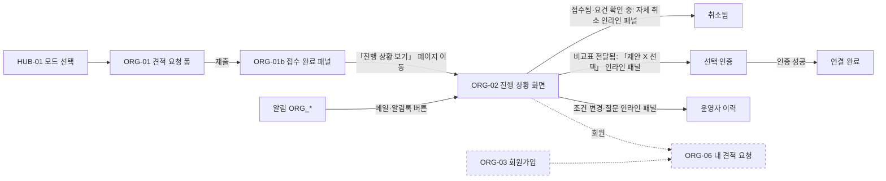
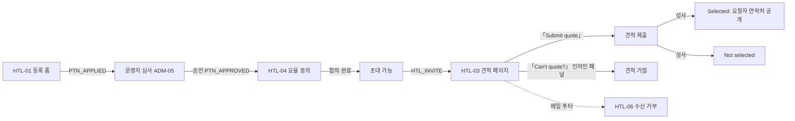
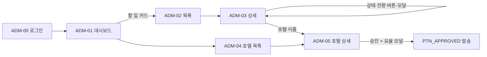
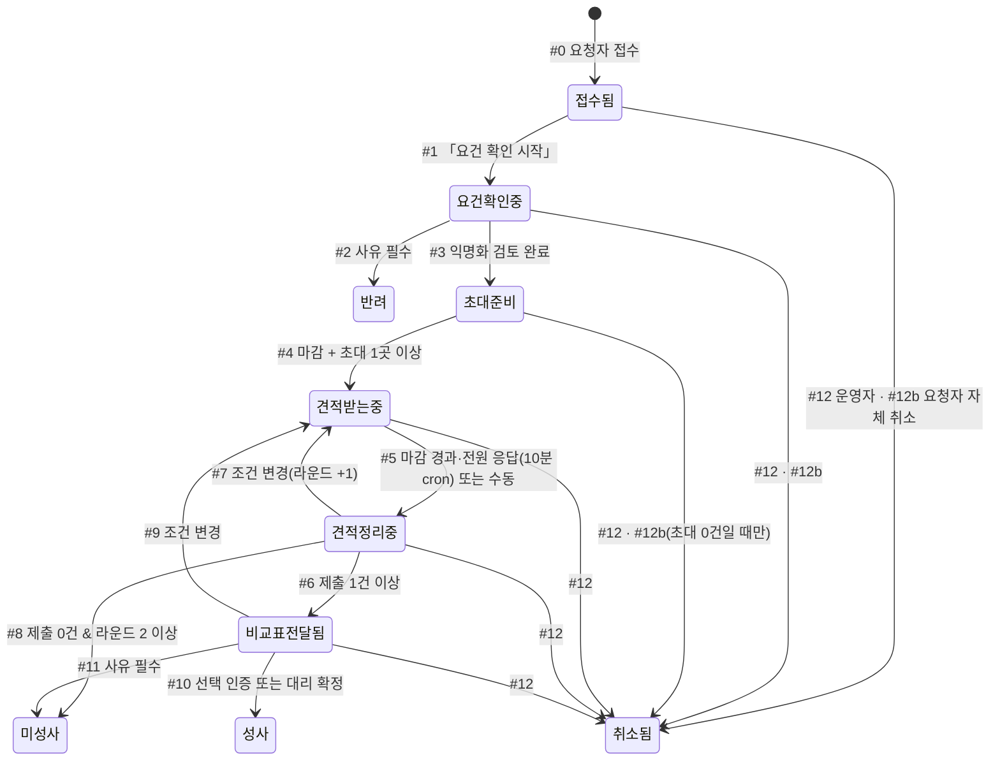
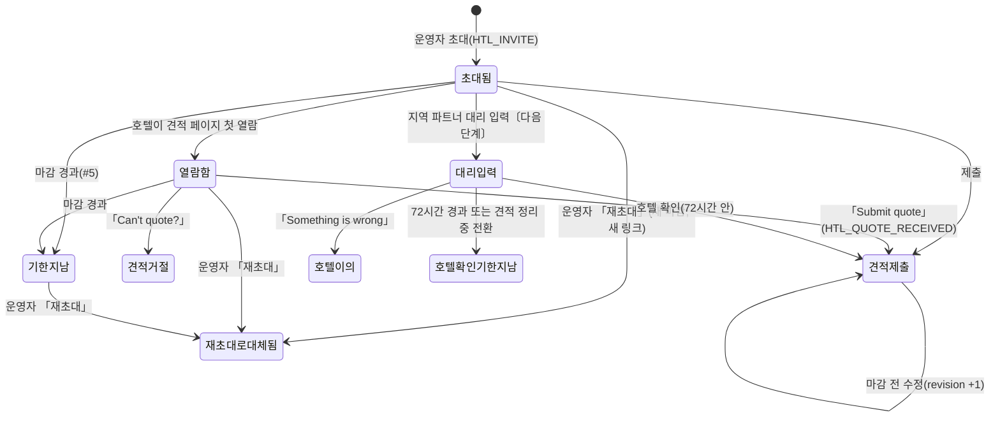
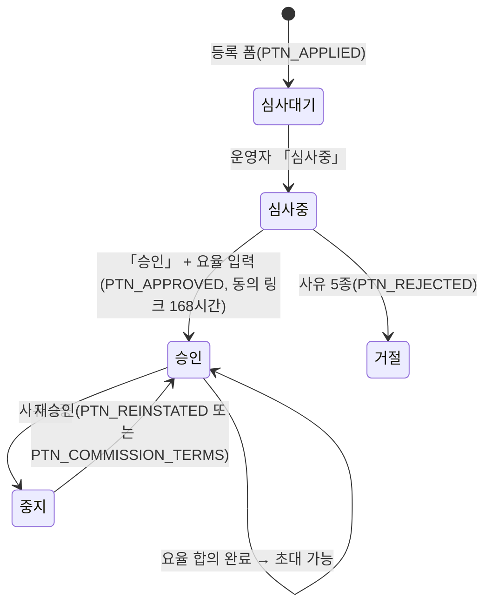

# MICEGO(마이스고) 개발 요청 명세서 v2 - 클로드

- 작성일 2026-10-09 · 작성 jwlim@staynmore.com(클로드 작성)
- 기준 코드: 브랜치 `docs/ux-spec-v2` (요청자 자체 취소·대리 확정 동의 기록·Turnstile이 들어간 `fix/urgent-cancel-consent-turnstile` 위)
- 바뀐 이유: 2026-10-08 개발 협업 통화 피드백(사람이 읽기 어려움, 용어 불일치, 버튼·상태 정의 부족, 이동 방식 불명확, MVP 범위 분리 필요)
- 이전 판: `docs/ux-flow-spec-v1 - 클로드.md` (기록용으로 남겨 둠)

| 파일 | 담은 내용 |
|---|---|
| 이 문서 | 0 읽는 법 · 1 서비스와 검증 목표 · 2 MVP 범위 · 3 용어집 · 4 화면 흐름도 · 6 공통 규칙 · 7 이후 단계 · 8 변경·소통 이력 · 부록 |
| [`ux-spec-v2/5a-requester.md`](ux-spec-v2/5a-requester.md) | 5장 A · 요청자 화면 (HUB-01, HUB-404, CMN-01·02, ORG-01, ORG-02, ORG-09, ORG-LEGAL) |
| [`ux-spec-v2/5b-hotel.md`](ux-spec-v2/5b-hotel.md) | 5장 B · 호텔 화면 (HTL-01·02·03·04·06) |
| [`ux-spec-v2/5c-console.md`](ux-spec-v2/5c-console.md) | 5장 C · 운영 콘솔 (ADM-00·01·02·03·04·05·10) |
| [`ux-spec-v2/5d-next.md`](ux-spec-v2/5d-next.md) | 5장 D · 다음 단계 화면 (회원제, 공유 링크, 대리 입력, 회원·피드백·정산·지역 파트너 콘솔) |
| [`ux-spec-v2/BRIEF.md`](ux-spec-v2/BRIEF.md) | 나눠 쓴 작성자용 공통 기준(이 문서 3장·4장과 같은 내용) |

---

## 0. 읽는 법

이 문서는 마이스고 화면이 지금 어떻게 동작하는지를 개발자가 그대로 구현할 수 있게 적은 설명서입니다.

- 기준은 현재 코드입니다. 코드와 문서가 다르면 코드가 맞습니다. 그런 곳을 찾으면 8장 질문 로그에 남겨 주세요.
- 화면마다 태그가 하나씩 붙어 있습니다. 〔MVP 핵심〕은 검증 기간에 꼭 필요한 것, 〔보조〕는 운영에 필요하지만 손으로 대신할 수 있는 것, 〔다음 단계〕는 검증 뒤에 만들 것입니다.
- 낯선 말이 나오면 3장 용어집을 먼저 보세요. 같은 대상은 이 문서 전체에서 한 이름으로만 부릅니다.
- 화면 설명은 모두 같은 순서입니다. 왜 필요한가 → ① 화면 상태 → ② 요소 → ③ 상태 전환 → ④ 숨길 정보 → ⑤ 미결.
- 이동 방식은 네 가지로만 씁니다. **페이지 이동**(주소가 바뀜) / **모달**(화면 위에 뜨고 뒤가 잠김) / **인라인 패널**(같은 화면 안에서 펼쳐짐) / **외부 앱**(메일 앱 등).
- 화면 ID(ORG-02 등)는 Figma 프레임 이름의 앞부분과 같습니다. 부록 A에서 대응표를 찾을 수 있습니다.
- **결정 대기**는 아직 정하지 않은 사업 결정입니다. 구현 전에 확인해 주세요.
- **(추정)**은 코드로 직접 확인하지 못한 내용입니다.
- 화면에 보이는 문구는 「」 안에 그대로 적었습니다. 호텔 화면은 영어 문구를 그대로 둡니다.

---

## 1. 서비스 한 줄 설명과 검증 목표

**한 줄 설명.** 한국 여행사·랜드사·기업 담당자(요청자)가 해외 행사 조건을 한 번 적어 내면, 마이스고가 신원을 뺀 요건서를 해외 호텔 여러 곳에 보내 견적을 받고, 한 장의 비교표로 정리해 돌려주는 서비스입니다. 요청자가 견적 하나를 고르면 그 호텔과 연결해 주고, 호텔은 성사된 건에 대해 커미션을 냅니다. 운영 주체는 매치고(MatchGo)입니다.

**검증하려는 두 흐름**

1. **견적 요청 접수** — 요청자가 폼으로 조건을 내고, 운영자가 요건을 확인합니다.
2. **호텔 견적 → 비교표 → 선택** — 운영자가 호텔을 초대하고, 호텔이 견적을 내고, 요청자가 비교표에서 하나를 고릅니다.

| 항목 | 내용 |
|---|---|
| 검증 통과 기준 | **결정 대기** — 예: "한 달 동안 실제 견적 요청 N건 중 M건이 비교표 전달까지, K건이 성사까지 간다" |
| 검증 기간 | 약 1개월. 시작일 **결정 대기** |
| 볼 숫자 | ① 접수 건수 ② 비교표 전달률(전달 ÷ 접수) ③ 성사율(성사 ÷ 전달). 호텔 쪽 견적 응답률(제출 ÷ 초대)은 참고 |
| 가벼운 대체 수단 검토 | 접수만 구글 폼으로 받고 비교표를 메일로 보내는 방식도 가능은 합니다. 다만 지금 코드는 비회원 접수 → 진행 상황 화면 → 선택까지 이미 완성돼 있어, 회원제·지역 파트너·정산을 끄는 쪽이 더 빠릅니다(2-3) |

---

## 2. MVP 범위

전체 제품을 먼저 문서로 정리했고, 검증 뒤에 MVP를 잘라 내기 쉽도록 모든 화면에 태그를 붙였습니다. 태그는 "검증에 필요한가"로만 정했습니다. 코드가 이미 있는지는 2-3의 "구현" 열에 따로 적었습니다.

### 2-1. 결정 대기 4건 (MVP를 자르기 전에 정할 것)

| # | 질문 | 지금 코드 | 영향 받는 화면 |
|---|---|---|---|
| G-1 | 요청자가 견적을 고를 때 **선택 인증(휴대전화 6자리)**을 MVP에서도 할까요? 아니면 요청자가 메일로 고르고 운영자가 **대리 확정**(동의 기록 필수)만 쓸까요? | 선택 인증 있음(문자 발송: Solapi) | ORG-02 선택 단계, ADM-03 성사, 알림 ORG_PICK_OTP, 약관 제7조 ④·⑧ |
| G-2 | 호텔이 **요율 합의**를 해야 초대할 수 있는 조건을 MVP에서도 둘까요? 아니면 운영자가 콘솔에 구두 합의를 기록하는 것으로 대신할까요? | 합의 전 초대 불가 | HTL-04, ADM-05 커미션 카드, ADM-03 초대 |
| G-3 | **호텔 등록 화면** 대신 운영자가 콘솔에서 호텔을 직접 등록해도 될까요? | 등록 폼 있음 | HTL-01, ADM-04/05 |
| G-4 | 검증 통과 기준 숫자와 시작일 | — | 1장 |

### 2-2. 포함 (MVP 핵심 · 보조)

| 화면 | 이름 | 태그 | 이유 |
|---|---|---|---|
| ORG-01 | 랜딩 + 견적 요청 폼 | 핵심 | 흐름 1의 시작 |
| ORG-02 | 진행 상황 화면 | 핵심 | 상태 안내·비교표·선택이 모두 여기. 공유 패널만 다음 단계, 선택 인증은 G-1 |
| CMN-02 | 개인 링크 공통 상태 | 핵심 | 불러오는 중·열 수 없는 링크 처리 없이는 ORG-02·HTL-03이 돌지 않음 |
| HTL-03 | 견적 페이지 | 핵심 | 흐름 2의 호텔 쪽 전부 |
| ADM-00 | 콘솔 로그인 | 핵심 | 운영자 진입 |
| ADM-01 | 대시보드 | 핵심 | 오늘 할 일. 지역 파트너 개입 위젯은 다음 단계 |
| ADM-02 | 견적 요청 목록 | 핵심 | 운영자가 요청을 찾는 유일한 길 |
| ADM-03 | 견적 요청 상세 | 핵심 | 상태 전환·익명화·초대·비교표·선정·성사가 모두 여기. 위임·대리 입력·소유·공유 카드는 다음 단계 |
| ADM-04/05 | 호텔 목록·상세 | 핵심 | 승인한 호텔만 초대할 수 있음. 커미션 카드는 G-2 |
| HUB-01, HUB-404 | 모드 선택 홈, 404 | 보조 | 진입과 링크 오류 안내 |
| CMN-01 | 의견 보내기 위젯 | 보조 | 검증 기간 의견 수집. 메일·통화로 대신할 수 있음 |
| ORG-09 / HTL-07 | 문의·FAQ·소개 | 보조 | 변경·질문의 대체 창구 |
| ORG-LEGAL | 약관·방침 | 보조 | 접수 동의 링크의 목적지(법무 검토 36곳은 별도) |
| HTL-01 | 호텔 등록 | 보조 | G-3 |
| HTL-02 | 견적 요청 예시 | 보조 | 영업 자료 |
| HTL-04 | 커미션 요율 동의 | 결정 대기 | G-2 |
| HTL-06 | 수신 거부 | 보조 | 상업 메일의 법적 요건 |
| ADM-10 | 설정 | 보조 | 공휴일 탭(영업일 계산)이 필요 |

알림은 두 흐름의 상태 변화를 상대에게 알리는 최소 세트가 핵심입니다. 요청자에게 ORG_RECEIVED·ORG_BIDDING·ORG_REBID·ORG_DELIVERED·ORG_WON·ORG_LOST·ORG_REJECTED·ORG_CANCELLED, 호텔에게 HTL_INVITE·HTL_REMINDER·HTL_QUOTE_RECEIVED·HTL_SELECTED_CONNECT·HTL_NOT_SELECTED가 나갑니다. ORG_PICK_OTP는 G-1을, PTN_* 호텔 온보딩 메일은 G-2·G-3을 따릅니다.

### 2-3. 제외 (다음 단계)

| 묶음 | 화면 | 구현 | 검증 기간에 어떻게 대신하나 |
|---|---|---|---|
| 회원제 | ORG-03~08(가입·로그인·재설정·내 견적 요청·계정·탈퇴), ADM-06/07 | 있음 | 비회원 흐름(개인 링크)이 이미 완결. 화면 링크만 숨기면 됨 |
| 공유 링크 | ORG-02s, ORG-02 공유 패널 | 있음(회원 전용) | 요청자가 진행 상황 링크를 직접 전달 |
| 지역 파트너 | ADM-00b·ADM-13, PTR-00~08, HTL-05(대리 입력 확인), ADM-03 위임 카드 | 있음 | 본사 운영자가 전부 처리(모든 요청 본사 보유) |
| 정산 | ADM-11/12 | 있음 | 성사 건 커미션은 수동 청구 |
| 피드백 콘솔 | ADM-08/09 | 있음 | 위젯 접수 메일로 확인 |

"다음 단계"가 곧 "코드 삭제"는 아닙니다. 위 화면은 메뉴와 링크를 숨기는 것으로 충분하고, 지울지 말지는 검증 뒤에 정합니다.

---

## 3. 용어집

같은 대상은 이 이름 하나로만 부릅니다. 코드 이름은 처음 나올 때만 괄호로 붙입니다. 사이트 카피와 약관은 다른 말을 쓰는 곳이 있어 3-2에 대응표를 두었습니다.

### 3-1. 표준 용어

| 용어 | 정의 | 코드 이름 | 쓰지 않는 말 |
|---|---|---|---|
| 요청자 | 해외 행사 호텔 견적을 요청하는 여행사·랜드사·기업 담당자 | organizer | 오거나이저, 고객 |
| 호텔 | 견적을 내는 해외 숙박 시설 | partners, hotel | 공급사, 벤더, 파트너(단독), 호텔 파트너 |
| 승인 호텔 | 심사를 통과해 초대할 수 있는 호텔 | partners.state=approved | 등록 호텔 |
| 지역 파트너 | 국가·지역 요청을 위임받아 처리하는 현지 회사(배분 70:30) | partner_org | 현지 파트너, 운영 파트너, 파트너사 |
| 파트너 관리자 / 파트너 담당자 | 지역 파트너 계정의 두 역할 | partner_admin / partner_member | 매니저 |
| 운영자 | 매치고 본사 운영 담당 | operator | 어드민, 본사(단독), 관리자 |
| 운영 콘솔 | 운영자·지역 파트너가 쓰는 관리 화면 | admin/ | 백오피스, 관리자 페이지, 어드민 |
| 견적 요청 | 요청자가 접수한 행사 1건(REF MG-YYMM-NNN) | rfp | RFP, 의뢰, 요청서, 요청 건 |
| 요건서 | 호텔에 보내는, 신원을 뺀 요청 내용 | bid Requirements | 요청서, RFP 문서 |
| 견적 | 호텔이 낸 금액·조건 1건 | quote | 비딩, 입찰, 오퍼 |
| 제안 A·B·C | 비교표에서 호텔명을 가린 견적 이름표(도착 순) | quotes.label | 옵션 1·2·3 |
| 비교표 | 받은 견적을 한 표로 정리한 결과 | compare | 리포트, 비교서 |
| 초대 | 호텔 한 곳에 견적 요청을 보내는 일 | invitation | 발송, 비딩 초대 |
| 견적 마감 | 호텔이 견적을 낼 수 있는 마지막 시각(초대별) | deadline | 비딩 마감 |
| 라운드 | 같은 요청에서 초대를 다시 돌린 차수 | round | 회차, 차수 |
| 조건 변경 | 조건이 바뀌어 새 라운드로 다시 초대하는 전환 | rebid | 재비딩 |
| 선택 | 요청자가 진행 상황 화면에서 견적 하나를 고르는 행동 | pick | 낙찰, 채택 |
| 선정 / 미선정 | 결과로 확정된 호텔 1곳 / 나머지 | invitation_result | 낙찰 / 탈락 |
| 선택 인증 | 선택할 때 휴대전화로 받는 6자리 확인 | ORG_PICK_OTP, pick_verify | OTP 선택, 본인 인증 |
| 대리 확정 | 선택 인증 없이 콘솔에서 성사 처리(동의 확인 기록 필수) | admin_transition + p_consent | 수동 성사 |
| 대리 입력 | 지역 파트너가 호텔 대신 견적을 넣고 호텔 확인을 받는 일 | partner_quote_proxy_enter | 대행 입력, 프록시 |
| 위임 / 본사 보유 / 본사 인계 | 견적 요청을 누가 처리하는지 나타내는 3상태. 배정은 위임하는 행위 | rfp_delegation | 할당, 이관 |
| 성사 | 선정 호텔에 연결 메일이 나가고 종료 | won | 계약 완료, 매칭 완료 |
| 미성사 | 선정 없이 종료 | lost | 유찰, 실패 |
| 반려 | 운영자가 요건 미충족으로 진행하지 않음 | rejected | 거절, 반려됨 |
| 취소됨 · 자체 취소 | 종료 전 철회. 요청자가 호텔 발송 전에 직접 하면 자체 취소 | cancelled, cancel_rfp | 철회 |
| 견적 거절 | 호텔이 견적을 내지 않겠다고 답함 | declined, decline_bid | 반려, 패스 |
| 진행 상황 화면 | 요청자 전용 링크 화면 | ko/track.html | 추적 페이지, 트래킹 |
| 견적 페이지 | 초대받은 호텔 전용 화면 | en/bid.html | 비딩 페이지 |
| 개인 링크 | 로그인 없이 여는 1인용 주소(`?t=`) | token | 매직 링크, 토큰 페이지 |
| 공유 링크 | 회원이 동료에게 주는 보기 전용 링크(`?s=`) | share | 공유 보기 |
| 회원 / 비회원 | 이메일·휴대전화 인증 계정이 있는지 없는지 | members | 게스트 |
| 커미션 | 성사 시 호텔이 매치고에 내는 수수료(요청자는 수수료 없음) | commission_rate_pct | 중개료 |
| 요율 합의 | 호텔이 커미션 요율에 클릭으로 동의함(합의 전 초대 불가) | partner_commission_accept | 커미션 동의 |
| 정산 | 성사 건의 커미션 입력 → 수금 → 송금 → 완료 | settlements | 결제 |
| 익명화 / 마스킹 | 요건서에서 신원 정보 제거 / 화면에서 일부 가림 | anonReviewed / maskPhone | 블라인드 |
| 회신 기한 · 영업일 | 요건 확인 시작부터 3영업일째 18:00 KST. 영업일은 주말·한국 공휴일 제외 | sla | SLA(콘솔 배지 인용만) |
| 알림 | 시스템이 자동으로 보내는 메일·알림톡·문자(템플릿 ID) | notification | 노티, 터치포인트 |

### 3-2. 다른 곳에서 쓰는 말 대응표

| 표준 용어 | 요청자 사이트·메일 | 호텔 화면(en) | 약관 |
|---|---|---|---|
| 요청자 | 주최 측, 요청하신 분 | organizer | 이용자, 비회원 요청자, 주최 측(조직) |
| 견적 | 제안 | quote | 견적 |
| 견적 마감 | 제안 마감 | Quote deadline | — |
| 진행 상황 화면 | 진행 상황 | — | 추적 링크 |
| 호텔 | 호텔 | Property / Hotel | 호텔 파트너 |
| 지역 파트너 | 현지 운영 파트너 | Regional Partner | 지역 운영 파트너 |

약관과 요청자 사이트 문구는 법무 검토·카피 담당 범위라 이번에 바꾸지 않았습니다.

### 3-3. 견적 요청 상태 이름

이번 개편에서 콘솔 라벨을 아래 표준 이름으로 바꿨습니다(코드 반영 완료). 요청자 화면 배지는 그대로 둡니다.

| slug | 표준 이름(문서·콘솔) | 바꾸기 전 콘솔 | 요청자 화면 배지 | 호텔 화면 |
|---|---|---|---|---|
| received | 접수됨 | 접수됨 | 접수됨 | (안 보임) |
| verifying | 요건 확인 중 | 검증중 | 요건 확인 중 | — |
| open | 초대 준비 | 오픈 | 요건 확인 중 (**결정 대기**, 4-2 참고) | — |
| bidding | 견적 받는 중 | 비딩중 | 호텔 제안 받는 중 / 라운드 2 이상은 「새 조건으로 재요청」 | Open for quotes |
| collecting | 견적 정리 중 | 취합중 | 제안 정리 중 | Quote received |
| delivered | 비교표 전달됨 | 전달됨 | 비교표 도착 | Quote received |
| won | 성사 | 성사 | 연결 완료 | Selected / Not selected |
| lost | 미성사 | 미성사 | 종료 | Quote received (결함 E-27) |
| rejected | 반려 | 반려됨 | 진행 불가 | — |
| cancelled | 취소됨 | 취소 | 취소됨 | Cancelled |

**초대 상태**: 초대됨(invited) · 열람함(viewed) · 견적 제출(submitted) · 견적 거절(declined) · 기한 지남(expired) · 재초대로 대체됨(reinvited) · 대리 입력·호텔 확인 대기(proxy_entered) · 호텔 확인 완료(hotel_confirmed) · 호텔 이의(proxy_disputed) · 호텔 확인 기한 지남(proxy_expired). **선정 결과**: 선정 / 미선정.

**콘솔 전환 버튼**: 「요건 확인 시작」 「초대 준비로」 「견적 받기 시작」 「견적 정리 시작」 「비교표 전달」 「성사로 닫기」 「미성사로 닫기」 「반려」 「조건 변경 → 새 라운드」 「요청 취소」.

---

## 4. 화면 흐름도

### 4-1. 역할별 흐름

**요청자** (〔다음 단계〕 화면은 점선)

**호텔**

**운영자**

지역 파트너 흐름은 〔다음 단계〕라 5장 D(`5d-next.md` 5절)에 적었습니다.

### 4-2. 견적 요청 상태 전이도

| # | 지금 → 다음 | 누가 | 조건 | 알림 |
|---|---|---|---|---|
| 0 | (없음) → 접수됨 | 요청자 | 필수 항목 입력, Turnstile 통과(사이트 키가 있을 때) | ORG_RECEIVED |
| 1 | 접수됨 → 요건 확인 중 | 운영자 | 없음. 이 시점부터 회신 기한을 셈 | — |
| 2 | 요건 확인 중 → 반려 | 운영자 | 사유 4종(국내 행사·일정 미확정·필수 정보 부족·기타는 메모) | ORG_REJECTED |
| 3 | 요건 확인 중 → 초대 준비 | 운영자 | 익명화 검토 완료 표시 | — |
| 4 | 초대 준비 → 견적 받는 중 | 운영자 | 견적 마감 설정 + 초대 1곳 이상(2곳 미만이면 확인 창) | ORG_BIDDING · 마감 24시간 전 HTL_REMINDER. HTL_INVITE는 이 전환 때가 아니라 운영자가 「초대 보내기」를 누를 때 바로 나갑니다(초대 준비에서도, E-55) |
| 5 | 견적 받는 중 → 견적 정리 중 | 시스템(10분마다 확인, 운영자 수동 가능) | 초대별 마감이 모두 지났거나 전원 응답. 응답 없는 초대는 기한 지남으로 바뀜 | — |
| 6 | 견적 정리 중 → 비교표 전달됨 | 운영자 | 제출 견적 1건 이상. 통화가 2종 이상이면 USD 참고·기준일 입력 | ORG_DELIVERED |
| 7·9 | 견적 정리 중·비교표 전달됨 → 견적 받는 중 | 운영자 | 요청 내용을 고친 뒤 실행. 라운드 +1, 마감 초기화 | ORG_REBID |
| 8 | 견적 정리 중 → 미성사 | 운영자 | 제출 0건 & 라운드 2 이상, 사유 필수 | ORG_LOST |
| 10 | 비교표 전달됨 → 성사 | 요청자(선택 인증, `pick_verify`) 또는 운영자·파트너 관리자(대리 확정, `admin_transition`). 파트너 담당자는 불가(FORBIDDEN) | 선정 표시가 정확히 1곳(GUARD_SELECT_ONE). 대리 확정은 `p_consent`에 확인 방법(이메일 회신·통화·기타), 확인 일시(접수 시각 이후, 지금+5분 이내), 근거(10~1000자)가 모두 있어야 함(GUARD_CONSENT) | ORG_WON · HTL_SELECTED_CONNECT · HTL_NOT_SELECTED (+정산 1건 생성). 파트너 관리자가 대리 확정하면 본사 콘솔에 HQ_PROXY_CONSENT_RECORDED |
| 11 | 비교표 전달됨 → 미성사 | 운영자 | 사유 3종 | ORG_LOST |
| 12 | 종료 전 6상태 → 취소됨 | 운영자(파트너 관리자도 가능〔다음 단계〕, 파트너 담당자는 불가) | 사유 필수(「요청자 취소 요청」 / 「기타」는 메모 필수) | ORG_CANCELLED(사유가 「회원 탈퇴」인 자동 취소는 안 나감). 호텔에는 자동 알림 없음(E-45) |
| 12b | 접수됨·요건 확인 중·초대 준비(지금 라운드 초대 0건) → 취소됨 | 요청자(`cancel_rfp`) | 개인 링크 소유자(공유 링크는 FORBIDDEN_SHARE). 사유 4종(일정 변경·다른 경로로 예약·행사 취소·기타), 「기타」는 메모 필수(500자 이내). 범위 밖이면 CANCEL_NOT_ALLOWED. 같은 요청을 두 번 보내도 같은 결과 | ORG_CANCELLED, 위임 건이면 담당 지역 파트너 콘솔에 PTR_ORG_CANCELLED |

이 표의 기준은 코드입니다(`private.rfp_transition`, `admin_transition` 0019, `private.rfp_organizer_cancel` 0020). `docs/state-transitions.html` v1.9는 #10의 동의 기록 가드와 #12b를 아직 담지 않았습니다(같은 문서 9장 o가 "미수록"으로 남아 있음). 둘이 다르면 이 표를 따릅니다.

**결정 대기 — 초대 준비의 요청자 화면 표시.** 초대 준비(open)에서도 운영자가 초대를 보낼 수 있습니다. 그런데 요청자 화면은 이 상태를 「요건 확인 중」으로 보여 주고 「호텔에는 아직 아무것도 보내지 않았습니다」라고 씁니다. 초대가 나간 뒤에는 틀린 말이 됩니다(E-34). 문구를 고칠지, 초대 준비를 별도 배지로 보여 줄지 정해야 합니다.

### 4-3. 초대 상태 전이도

- 호텔 확인 완료(`hotel_confirmed`)는 예비 값입니다. 서버는 호텔이 대리 입력을 확인하면 초대를 곧바로 견적 제출(`submitted`)로 바꾸고, 확인 시각을 견적에 남깁니다(0013).
- 「조건 변경 → 새 라운드」는 이전 라운드 초대의 상태를 바꾸지 않습니다. 운영자가 그 호텔을 「재초대」해야 이전 초대가 재초대로 대체됨이 되고, 새 링크로 HTL_INVITE가 나갑니다.

성사 때 견적을 낸 초대에는 선정 / 미선정 결과가 붙습니다. 결과는 「성사로 닫기」 한 번에 함께 정해지며, 선정·미선정 표시만으로는 메일이 나가지 않습니다.

### 4-4. 호텔 심사·요율 합의

요율 합의 전에는 승인 호텔이라도 초대할 수 없습니다(G-2).

### 4-5. 알림과 버튼이 여는 화면

| 알림 | 받는 사람 | 언제 | 버튼이 여는 화면 | 태그 |
|---|---|---|---|---|
| ORG_RECEIVED | 요청자 | #0 | ORG-02 | 핵심 |
| ORG_REJECTED · ORG_BIDDING · ORG_REBID · ORG_DELIVERED · ORG_WON · ORG_LOST · ORG_CANCELLED | 요청자 | #2·#4·#7/#9·#6·#10·#8/#11·#12/#12b | ORG-02 | 핵심 |
| ORG_PICK_OTP (문자만) | 요청자 휴대전화 | 「제안 X 선택」 | ORG-02 선택 인증 칸에 입력 | G-1 |
| HTL_INVITE · HTL_REMINDER | 호텔 | 「초대 보내기」·「재초대」를 누른 즉시(초대 준비에서도, E-55), 마감 24시간 전 | HTL-03 | 핵심 |
| HTL_QUOTE_RECEIVED | 호텔 | 제출·수정 | HTL-03 (견적 제출) | 핵심 |
| HTL_SELECTED_CONNECT · HTL_NOT_SELECTED | 호텔 | #10 | HTL-03 (Selected / Not selected) | 핵심 |
| PTN_APPLIED · PTN_APPROVED · PTN_COMMISSION_TERMS · PTN_REJECTED · PTN_REINSTATED | 호텔 | 심사·요율 | HTL-04 (승인·요율 메일만) | 보조 / G-2 |
| HTL_CONFIRM, CONSOLE_NOTICE(PTR_*·HQ_* 콘솔 알림을 한 템플릿으로 보냄), ACC_*, FB_* | 각자 | 다음 단계 기능 | HTL-05, 콘솔, 회원 화면 | 다음 단계 |

---

## 5. 기능별 상세

화면이 많아 네 파일로 나눴습니다. 순서는 핵심 → 보조 → 다음 단계입니다.

- **5장 A 요청자** [`ux-spec-v2/5a-requester.md`](ux-spec-v2/5a-requester.md) — HUB-01, HUB-404, CMN-02, CMN-01, ORG-01(01a·01b), **ORG-02**, ORG-09/HTL-07, ORG-LEGAL
- **5장 B 호텔** [`ux-spec-v2/5b-hotel.md`](ux-spec-v2/5b-hotel.md) — HTL-01, HTL-02, **HTL-03**, HTL-04, HTL-06
- **5장 C 운영 콘솔** [`ux-spec-v2/5c-console.md`](ux-spec-v2/5c-console.md) — 콘솔 공통, ADM-00, ADM-01, ADM-02, **ADM-03**, ADM-04, ADM-05, ADM-10
- **5장 D 다음 단계** [`ux-spec-v2/5d-next.md`](ux-spec-v2/5d-next.md) — ORG-02s, ORG-03~08, HTL-05, ADM-00b/PTR-00, ADM-06~09, ADM-11~13, PTR-01~08

굵게 표시한 세 화면(ORG-02, HTL-03, ADM-03)이 두 흐름의 중심입니다. 처음 읽는다면 이 셋부터 보세요.

---

## 6. 공통 규칙

### 6-1. 신원 숨김
- 호텔은 선정 전까지 요청자의 회사명·담당자·연락처·예산을 볼 수 없습니다. 견적 페이지는 Selected 상태에서만 요청자 연락처를 보여 줍니다.
- 요청자는 선정 전까지 호텔명을 볼 수 없습니다. 비교표에는 제안 A·B·C로만 나옵니다.
- 커미션 요율은 요청자 화면 어디에도 나오지 않습니다(검증 스크립트 `verify2.py`가 확인).
- 공유 링크로 연 화면에는 선택·변경·취소 요소가 없습니다. 서버도 FORBIDDEN_SHARE로 거부합니다.
- 지역 파트너 콘솔은 요청자 회사명을 첫 글자만 보여 줍니다(한**). 전체를 보려면 「요청자 정보 보기」를 눌러야 하고, 볼 때마다 기록이 남습니다.

### 6-2. JS 꺼짐 · 모드
- 공개 화면은 JS가 꺼져도 핵심 내용이 보입니다(`js-anim` 부모 클래스 + 안전장치).
- 진행 상황 화면·견적 페이지는 JS가 꺼지면 빌드 때 넣은 예시 상태가 보입니다(E-31). 선택 버튼은 메일 초안으로 바뀌고, 서버가 선택 인증을 강제합니다.
- 요율 동의·대리 입력 확인 화면은 JS가 필요하다는 안내를 보여 줍니다.
- 운영 콘솔은 JS가 꼭 필요합니다.
- 모드는 `site.config.json`의 Supabase 주소 유무로 정해집니다. 공개 화면은 api 모드 / 메일 모드(mailto), 콘솔은 api 모드 / 데모 모드(mock)입니다.
- 데모 빌드는 `?state=`로 상태를 미리 볼 수 있고, 운영 빌드는 이 기능과 데모 문구를 뺍니다. 콘솔 데모는 브라우저 세션 저장소에 상태를 담고, `?as=partner`로 지역 파트너 화면을 볼 수 있습니다.

### 6-3. 모바일
- 360px·768px·1280px 너비에서 검사합니다(콘솔 오류 0, 가로 넘침 없음).
- 비교표는 768px 이하에서 카드 보기가 기본입니다. 표 보기는 가로 스크롤 영역입니다.
- 콘솔은 좁은 화면에서 사이드바가 위쪽 접는 메뉴가 됩니다. 칸반은 1024px 이상에서만 보입니다.
- 입력 칸은 터치 대상 44px입니다. 인증번호 칸은 숫자 키패드와 자동 채우기를 켭니다.

### 6-4. 기한 · 한도

| 무엇 | 값 |
|---|---|
| 회신 기한 | 요건 확인 시작부터 3영업일째 18:00 KST. 임박 = 다음 영업일 18:00 이내 또는 24시간 이내 |
| 견적 마감 기본값 | 3영업일(200명 이상 5영업일). 마감 24시간 전 리마인더 |
| 견적 정리 중 자동 전환 | 10분마다 확인 |
| 알림 발송 | 1분마다 발송. 알림톡이 실패하면 장문 문자(LMS)로 대신 보내고 메일도 함께 보냄 |
| 호텔 심사 | 5영업일 |
| 요율 동의 링크 / 대리 입력 확인 링크 | 168시간 / 72시간 |
| 선택 인증번호 | 3분 유효, 60초 뒤 재발송, 발송은 요청당·휴대전화당 하루 10회, 5번 틀리면 10분 잠금 |
| 견적 요청 접수 | IP당 10분 5회, 이메일당 하루 20회 |
| 조건 변경·질문 | 요청당 하루 10회(합산) |
| 자체 취소 | IP당 10분 10회, 요청당 하루 5회 |
| 진행 상황 조회 · 견적 페이지 조회 | IP당 분당 60회. 없는 링크 조회는 IP당 10분 20회 |
| 견적 제출 · 견적 거절 | 개인 링크당 1시간 30회 / 10회 |
| 공유 링크 | 요청 종료 뒤 30일에 만료 |

### 6-5. 오류 표시
- 서버 오류 코드와 문구는 `supabase/functions/_shared/errors.ts` 한 곳에 있고, 화면 쪽(`assets/mg.js`, `admin/admin.js`)이 같은 문구를 씁니다.
- 입력 칸 오류는 칸 아래 문구로, 나머지는 토스트로 보여 줍니다.
- 콘솔에서 서버 오류 문구가 `MG:…` 그대로 보이는 곳이 남아 있습니다(E-50).

### 6-6. 알림 공통
- 알림 템플릿은 `build_notify.py`가 원본이고 `docs/notification-library.html`로 볼 수 있습니다.
- 요청자에게는 알림톡과 메일이, 호텔에게는 메일만 나갑니다. 선택 인증번호는 문자로만 보냅니다.
- 메일 버튼은 모두 개인 링크입니다. 링크를 잃어버린 요청자는 문의로 다시 받습니다.

---

## 7. 이후 단계 후보

| 묶음 | 왜 나중인가 | 관련 화면 |
|---|---|---|
| 회원제 | 비회원 개인 링크로 두 흐름이 끝까지 돕니다. 재방문 요청자가 생기면 필요합니다 | ORG-03~08, ADM-06/07 |
| 공유 링크 | 회원제에 딸린 기능입니다 | ORG-02s |
| 지역 파트너 | 검증 기간에는 본사가 모든 요청을 직접 처리합니다 | PTR-*, ADM-13, HTL-05 |
| 정산 | 성사 건이 쌓이기 전에는 수동 청구로 충분합니다 | ADM-11/12 |
| 피드백 콘솔 | 검증 기간에는 메일로 확인합니다 | ADM-08/09 |
| 호텔 신청 상태 화면 | 지금은 등록 뒤 결과 메일까지 확인할 곳이 없습니다(v1 E-5) | 신규 |
| 메시지 기록 | 조건 변경·질문을 보낸 기록이 화면에 남지 않습니다(v1 E-13) | ORG-02 |

### 7-1. 개선 목록 위치

| 번호 | 내용 | 있는 곳 |
|---|---|---|
| E-1~E-20 | v1 개선 노트. **E-2(자체 취소)·E-3(동의 기록)·E-4(Turnstile)는 해결**, 나머지는 각 화면 ⑤에서 이어 씀 | v1 E절, 5장 각 화면 |
| E-21~E-25 | v1 머리말에만 이름이 있고 본문이 없습니다. Figma 개선 보드에서 옮겨 와야 합니다 | 확인 필요 |
| E-26~E-39 | 요청자 화면 | 5장 A 「A 묶음 작성 메모」 |
| E-40~E-49 | 호텔 화면 | 5장 B 「B 묶음 작성 메모」 |
| E-50~E-69 | 운영 콘솔 | 5장 C 「열린 항목」 |
| E-70~E-89 | 다음 단계 화면 | 5장 D 6절 |
| E-90~E-92 | 독립 검증(2026-10-09)에서 덧붙인 것. E-90 콘솔 불러오는 중 표시 없음 · E-91 운영자 탈퇴 처리가 전이 함수 없이 요청을 취소함 · E-92 조건 변경 뒤 이전 라운드 초대가 그대로 남음 | 5장 C 열린 항목 · 5장 D 6절 · 5장 B HTL-03 ⑤ |

**먼저 고칠 것 (MVP 핵심 화면)**
- **E-1** 진행 상황 화면·견적 페이지가 상태와 REF만 서버 값으로 바꾸고, 일정·요건·비교표는 빌드 때 예시 값이 남습니다. 서버는 이미 값을 내려 줍니다. 화면이 읽기만 하면 됩니다.
- **E-34** 초대 준비 상태의 요청자 화면 문구(4-2).
- **E-27** 미성사로 끝난 요청을 호텔은 계속 「Quote received」로 봅니다.
- **E-45** 견적 받는 중 이후 취소해도 호텔에게 자동 알림이 없습니다.
- **E-53** 콘솔의 「선정」 표시를 서버가 1곳으로 제한하지 않습니다. 두 곳이 선정으로 남으면 「성사로 닫기」가 막히고 원인 문구가 `MG:GUARD_SELECT_ONE` 그대로 보입니다(5장 C).
- **E-92** 「조건 변경 → 새 라운드」 뒤에도 이전 라운드 초대가 열려 있어, 재초대하지 않은 호텔이 이전 화면을 보거나 이전 라운드 견적을 고쳐 낼 수 있습니다(5장 B, **결정 대기**).

---

## 8. 변경 · 소통 이력

### 8-1. 버전

| 버전 | 날짜 | 작성 | 바뀐 것 |
|---|---|---|---|
| v1 | 2026-10-07 | jwlim(클로드 작성) | 화면 인벤토리·흐름·동작 노트·개선 노트 E-1~20·Figma 구성 |
| v2 | 2026-10-09 | jwlim(클로드 작성) | 개발 통화 피드백 반영. 0~8장 구성, 용어집, 상태 이름 쉬운 말로 통일(콘솔 라벨 코드까지), 요청자 호칭 통일, 화면 템플릿(상태·요소·전환·이동 방식), MVP 태그와 결정 대기 4건, E-26~89 |

### 8-2. 개발자 질문 로그

질문과 답은 지우지 않고 여기에 쌓습니다. 다음 문서의 기준이 됩니다.

| # | 날짜 | 질문·피드백 (출처) | 답 · 반영 위치 |
|---|---|---|---|
| Q-1 | 10-08 | 검증 전 단계라 회원가입 같은 기능은 필요 없다 (개발 통화) | 2-3 회원제를 다음 단계로 분리. 비회원 흐름으로 검증 |
| Q-2 | 10-08 | 꼭 필요한 건 요청을 자세히 받는 부분과 제안·답변을 내는 부분 (개발 통화, 변환 품질 낮음) | 1장 두 흐름으로 명시. 정확한 뜻은 원음 재확인 필요 |
| Q-3 | 10-08 | 기계가 쓴 느낌이라 읽기 어렵다 | 0장 문체, 3장 용어집, 전 장 다시 씀 |
| Q-4 | 10-08 | 버튼 하나가 왜 있는지, 상태별로 어떻게 달라지는지가 중요하다 | 5장 템플릿 ② 요소 표(왜 있나·상태 5종), ③ 상태 전환 표 |
| Q-5 | 10-08 | 지금 문서로는 구현 수준까지 가기 어렵다 | 이동 방식 4종 명시, 데이터 출처(서버/고정/예시) 명시 |
| Q-6 | 10-08 | AI가 만든 문서는 작성자가 1~3차 검증을 직접 해야 한다 | 부록 C 검증 체크리스트 |
| Q-7 | 10-08 | 매치고는 Figma로 UX·흐름 방향을 정해 둔 게 도움이 됐다 | 부록 A Figma 대응표, Figma 반영 지시서(`docs/ux-spec-v2/figma-update-sheet.md`, 예정) |

매치고 Figma 댓글 52개에서 개발자가 가장 많이 물은 것(취소는 어디서 여나, 완료는 언제 되나, 확인 화면은 어디인가, 돈 흐름은 어떻게 되나, 상태 전이도가 있나)은 5장 각 화면 ③과 4-2~4-4에 미리 답해 두었습니다.

### 8-3. 검증 기록

- 날짜: 2026-10-09 · 검증: 독립 검증 에이전트(문서를 쓰지 않은 검토자) · 기준: 브랜치 `docs/ux-spec-v2` 작업 트리(콘솔 라벨 개편 반영본)
- 범위: 이 문서와 `ux-spec-v2/5a~5d`. 문서 구조는 바꾸지 않고 해당 줄만 고쳤습니다.

| 차수 | 무엇을 봤나 | 고친 것 |
|---|---|---|
| 1차 · 용어와 문장 | 3-1 "쓰지 않는 말"과 금지 표현을 다섯 문서 전체에서 찾음. 「」 인용·코드 표기·용어집·부록 B는 제외. 문장은 파일마다 10개 안팎을 소리 내어 읽음 | 약 30곳. 「공유 보기」→「공유 링크 화면」(5장 A 10여 곳), 「노출」·「활성화」·「오픈 전」 등 금지어 6곳, 콘솔 옛 이름이 남았다고 적은 설명 4곳(5장 C 머리말·5장 D 4절·메모 2곳), 메뉴 이름을 「」 인용으로 바꾼 곳 6곳, 어색한 문장 몇 곳 |
| 2차 · 상태와 흐름 | 상태 수를 코드와 대조(ORG-02 12 = `TRACK_STATES`, HTL-03 9 = `BID_STATES`, HTL-04 6 + noscript = `build_commission.py`, HTL-06 5 = `UNSUB_STATES`, ADM-03 요청 10 + 초대 10 = `admin.js` `STATES`·`INV`, ORG-03~08 12·6·6·6·7·5 = `ACC_STATES`) → 모두 일치. 4-2 전이표를 `state-transitions.html`과 SQL 가드(0013 `rfp_transition`, 0019 `admin_transition`, 0020 `rfp_organizer_cancel`, `cancel_rfp`)에 대조. 4-5 알림이 전이표에 모두 있는지 확인 | 약 25곳. 4-2 #4(HTL_INVITE는 초대 보낼 때 나감), #5(10분 작업), #10(동의 기록 검사 조건·파트너 담당자 불가·HQ 알림), #12(파트너 관리자·「요청자 취소 요청」·탈퇴 취소 무알림), #12b(사유 목록·CANCEL_NOT_ALLOWED·PTR_ORG_CANCELLED). 4-3(대리 입력 확인 → 견적 제출, 재초대 출발 상태). 6-4(선택 인증번호 하루 10회, 조회·제출 한도). 5장 C 힌트·가드 문구 5곳을 코드 문구로, HTL_REMINDER 주기. 5장 B 초대 시점·자동 전환 주기·재초대·취소 주체 5곳. 5장 D 정렬 문구 등 |
| 3차 · 개발자 관점 | ORG-01·ORG-02·HTL-03·ADM-03의 데이터 출처·서버 호출·권한·MVP 태그·Figma 이름 확인(모두 있음). 네 파일 사이 E 번호·E-27·취소 규칙·한도 대조 | E-27을 "후보"에서 코드 확인된 결함으로 맞춤. E-57과 E-88이 같은 문제임을 서로 적음. 5장 C 메모 표를 개편 뒤 코드 기준으로 다시 씀. 새 미결 3건(E-90 콘솔 불러오는 중 표시 없음, E-91 운영자 탈퇴 처리가 전이 함수 없이 요청 상태를 바꿈, E-92 조건 변경 뒤 이전 라운드 초대가 열린 채 남음) |

**남은 문제 (사용자 결정 또는 다른 문서 수정 필요)**
- `docs/state-transitions.html` v1.9가 #10 동의 기록과 #12b 자체 취소를 아직 담지 않았습니다. 이 검증의 수정 범위 밖이라 그대로 두었습니다.
- `ux-spec-v2/BRIEF.md` 1절은 "콘솔 라벨 코드 수정은 별도 진행"이라고 적혀 있는데, 이 브랜치에서는 이미 바뀌었습니다.
- 콘솔 메뉴 「견적 관리」 「호텔 파트너」와 「추적 링크 복사」 「승인 파트너」는 아직 옛 말입니다. 바꿀지 정해야 합니다(5장 C 메모).
- 취소 사유가 「오거나이저 요청」(기존 DB 값)과 「요청자 취소 요청」(새 값)으로 나뉘어 쌓입니다.
- **결정 대기**: E-92(새 라운드 때 이전 라운드 초대를 닫을지), E-91 수정(새 마이그레이션 필요), 2-1의 G-1~G-4, E-34/E-55(초대 준비 단계의 이름과 초대 시점).
- E-21~E-25는 여전히 본문이 없습니다(7-1).

---

## 부록 A. Figma 대응표

Figma 파일: `1zo93NzgNoMv8eMkHX9t2I` (MICEGO UI/UX 플로우). 프레임 이름 규칙은 `화면 ID · 상태` 입니다(예: `ORG-02 · delivered`).

| Figma 페이지 | 담는 화면 | v2 위치 |
|---|---|---|
| 00 개요·IA | 서비스 한 줄, 화면 목록, 범례(태그 3색·이동 방식 4종) | 0·1·2장 |
| 01 사용자 플로우 | 역할별 흐름 4종 | 4-1 |
| 「02 화면 · 오거나이저」(Figma 페이지 이름 그대로. 「요청자」로 바꿀 예정) | HUB-01, ORG-01, ORG-02 상태별 | 5장 A |
| 03 화면 · 호텔 | HTL-01~06 | 5장 B |
| 04 화면 · 운영 콘솔 | ADM-00~05, ADM-10 | 5장 C |
| 05 화면별 동작 노트 | 화면별 상태·분기 노트 | 5장 각 화면 ①~③ |
| 06 개선 보드 | E-번호 스티커 | 7-1 |
| 07 상태 전이도 (추가 예정) | 견적 요청·초대·호텔 심사 전이도 | 4-2~4-4 |

## 부록 B. 이름 바꾸기 대응표 (옛 이름 → 새 이름)

| 옛 이름 | 새 이름 |
|---|---|
| 오거나이저 | 요청자 |
| 검증중 / 오픈 / 비딩중 / 취합중 / 전달됨 / 반려됨 / 취소 | 요건 확인 중 / 초대 준비 / 견적 받는 중 / 견적 정리 중 / 비교표 전달됨 / 반려 / 취소됨 |
| [검증중(으)로] 등 상태명 버튼 | 「요건 확인 시작」 「초대 준비로」 「견적 받기 시작」 「견적 정리 시작」 「비교표 전달」 「성사로 닫기」 「미성사로 닫기」 「반려」 「조건 변경 → 새 라운드」 「요청 취소」 |
| 초대 / 열람 / 제출 / 거절 / 마감 / 재초대됨 | 초대됨 / 열람함 / 견적 제출 / 견적 거절 / 기한 지남 / 재초대로 대체됨 |
| RFP, 요청 건 | 견적 요청 |
| 비딩 | 견적 |
| 추적 페이지 | 진행 상황 화면 |
| 수동 성사, 운영자 대리 확정 | 대리 확정 |

## 부록 C. 작성자 검증 체크리스트 (1~3차)

**1차 · 용어와 문장**
- [ ] 3-1 "쓰지 않는 말"이 본문에 남아 있지 않다(화면 문구 인용 「」·3-2 대응표 제외).
- [ ] 금지 표현("~에 대한", "~를 통해", "~가 진행됩니다", "제공하다", "활성화", "노출", "트리거" 등)이 없다.
- [ ] 영문 slug와 API 이름은 괄호 안이나 코드 표기 안에만 있다.
- [ ] 장마다 문장 10개를 소리 내어 읽어 어색한 문장이 없다.

**2차 · 상태와 흐름의 빠진 곳**
- [ ] 화면별 상태 수가 코드와 같다(ORG-02 12, HTL-03 9, HTL-04 6, HTL-06 5, ADM-03 요청 10 + 초대 10 등).
- [ ] ② 요소 표의 모든 버튼에 이동 방식이 있다.
- [ ] ③ 상태 전환 표의 "다음"이 ① 상태 표나 다른 화면 ID에 있다. 종료 상태에서 나가는 전환이 없다.
- [ ] 4-5의 모든 알림이 어느 전환에 한 번 이상 나온다.
- [ ] 핵심 화면마다 불러오는 중·빈 상태·오류 상태가 있다.
- [ ] 매치고에서 나온 질문(취소는 어디서, 완료는 언제, 확인 화면은 어디, 돈 흐름은 어떻게)에 핵심 화면마다 답이 있다.

**3차 · 개발자 입장에서 막히는 곳**
- [ ] 핵심 화면마다 데이터 출처(서버 응답 필드 / 빌드 고정 / 예시 값)가 있다.
- [ ] 요소마다 서버 호출과 권한(소유자 / 공유 링크 / 회원 / 운영자 / 파트너 관리자·담당자)이 있다.
- [ ] 모든 화면 ID에 MVP 태그와 Figma 프레임 이름이 있다.
- [ ] 결정 대기와 (추정)이 표시돼 개발자가 짐작할 필요가 없다.
- [ ] 8-2 질문 로그가 비어 있지 않다.
