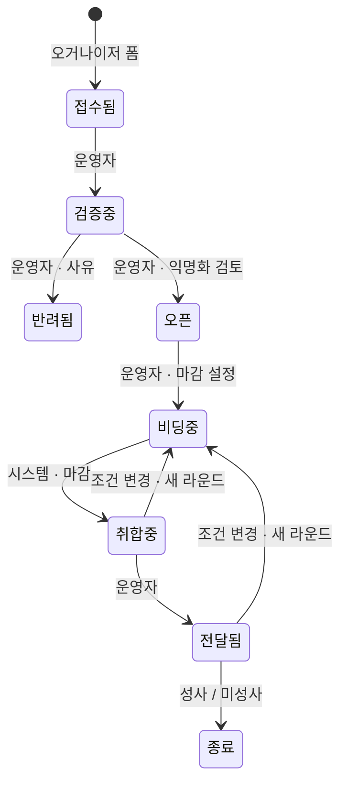

# MICEGO 운영 SOP v2 — 상태전이 시스템 기준

Sep 25, 2026 · @jwlim

## 목적과 범위

이 SOP는 운영 콘솔과 자동 전이가 돌아가는 상태에서 견적 요청(RFP) 한 건을 접수부터 종료까지 처리하고, 호텔 파트너 심사를 마치는 기준이다. v1(2026-08-10, mailto 접수 기반)을 대체한다.

v1과 달라진 점:

- 접수·등록이 이메일이 아니라 DB에 바로 쌓인다. 운영자는 메일함이 아니라 콘솔 칸반을 본다.
- 상태는 콘솔 버튼으로만 바뀐다. 허용되지 않는 전이 버튼은 아예 보이지 않는다.
- 마감 처리·취합 전환·알림 발송·리마인더는 시스템이 한다. 운영자가 손으로 하던 v1의 5단계(SLA 추적)는 없어졌다.
- 익명화는 검토 체크만 한다. 회사명·예산은 별도 테이블에 있어 호텔 화면에 구조적으로 나가지 않는다.
- 선정 시 오거나이저 신원이 선정 호텔에 자동 공개된다(약관 제7조).

이 문서는 운영자 1명 체제를 전제로 쓴다. 지침 순서는 상태전이표(v1.2)와 같다.

## v2.1 변경 사항 (2026-09-26)

운영 콘솔 목업과 상태전이표 v1.4를 맞추면서 아래 7가지를 확정했다. 운영해 보고 필요하면 다시 바꾼다.

| 항목 | 바뀐 내용 |
| --- | --- |
| 견적 0건 종료 | 취합중에서 제출 0건이고 라운드 2 이상이면 미성사로 바로 닫는다(사유: 두 차례 요청에도 제안 없음). 라운드 1이면 먼저 새 라운드를 연다. |
| SLA 임박(황색) | 기한이 다음 영업일 18:00 이내이거나 24시간 이내이면 황색이다. 주말·공휴일 앞에서도 경고가 뜬다. |
| 오픈 상태 기한 | 오픈에 도달하면 SLA는 충족이다. 오픈 이후에는 같은 기한을 초대 기한으로 보고, 콘솔도 초대 기한으로 표시한다. |
| USD 참고환산 | 호텔이 제출한 금액을 세금 조정 없이 그대로 환산한다. 세금 별도 여부는 비교표 세금 칸에 그대로 둔다. |
| 호텔 결과 확인 | 견적을 낸 호텔은 초대 링크에서 선정·미선정 결과를 본다. 링크는 마감 후 제출만 막는다. |
| 초대별 마감 | 초대마다 마감을 저장한다. 마감을 바꿔도 이미 보낸 초대는 그대로이고, 새 마감이 필요한 호텔은 재초대한다. |
| 선정 후 연결 메일 | 성사 전이 때 시스템이 자동으로 보낸다(오거나이저 참조). 운영자는 발송 로그에서 확인한다. |

남은 미결은 폼·선택 제출을 mailto에서 RPC로 바꾸는 일 하나다(전제 조건 참조).

## 역할과 도구

상태를 바꾸는 주체는 세에 하나다: 운영자, 시스템(cron), 호텔(토큰 링크). 오거나이저는 접수 외에 상태를 바꾸지 않는다.

| 역할 | 하는 일 | 바꾸는 상태 |
| --- | --- | --- |
| 운영자 | 검증·익명화 검토·마감 설정·호텔 초대·비교표 확인·전달·종료·파트너 심사 | 검증중, 반려, 오픈, 비딩중, 전달됨, 종료, 취소, 선정/미선정, 파트너 전부 |
| 시스템(cron) | 10분: 마감 지난 초대 마감 처리, 취합중 전환. 1분: 알림 발송, 리마인더 정리 | 취합중, 초대 마감(expired) |
| 호텔 | 초대 링크 열람·견적 제출·수정·거절 | 열람, 제출, 거절 |
| 오거나이저 | 접수 폼 제출, 추적 링크로 상태 확인, 이메일로 선정 통보 | 접수됨(폼) |

도구:

- 운영 콘솔(micego-admin.html): 견적 요청 칸반, 요청 상세, 호텔 파트너, 설정. 모든 상태 변경은 여기서 한다.
- Supabase 대시보드: notification 테이블(발송 실패 확인), kr_holiday(공휴일 입력), app_config(워커 주소). 평소에는 열지 않는다.
- 이메일: 자동 발송은 시스템이 한다. 운영자가 직접 보내는 것은 호텔 팔로업과 예외 상황 안내 두 가지뿐이다(선정 후 연결 메일은 v2.1부터 자동).

직접 UPDATE로 상태를 바꾸지 않는다. DB가 막기도 하지만, 바꾸면 이력과 알림이 빠진다.

## 일일 루틴

매일 오전과 오후 한 번씩, 콘솔 칸반을 이 순서로 본다. 15분을 넘기지 않는다.

1. 적색 좌측 바(SLA 초과) 카드 — 오늘 안에 오거나이저에게 진행 상황을 회신한다. 회신이 어려운 사유가 있으면 예상일을 알린다.
2. 황색 좌측 바(SLA 24시간 이내) 카드 — 검증중이면 오늘 오픈까지, 오픈이면 오늘 초대까지 끝낸다.
3. 접수됨 열 — 새 요청은 받은 당일 검증중으로 넘긴다. 이 버튼이 SLA 기산점이므로 미루지 않는다.
4. 비딩중 카드의 "견적 n/m · 마감 ○시간 후" — 마감 24시간 이내인데 제출이 0이면 상세에서 미응답 호텔에 팔로업 메일을 보낸다. 자동 리마인더는 이미 나갔으므로 전화나 개인 메일로 한다.
5. 취합중 열 — 비교표를 검토하고 당일 전달한다. 통화가 섞여 있으면 USD 참고환산을 먼저 입력한다.
6. 호텔 파트너 탭의 "지연" 배지 — 5영업일이 지난 신청을 오늘 심사한다.
7. 주 1회(월요일): Supabase에서 notification 테이블을 status = failed로 필터해 본다. 있으면 수신 주소를 확인하고 직접 메일로 대신 보낸다.

## RFP 처리 절차

한 건은 접수됨→검증중→오픈→비딩중→취합중→전달됨→종료 순으로 간다. 운영자가 누르는 전이는 5번, 시스템이 하는 전이는 1번이다.

취소는 종료 전 어느 상태에서도 가능하며 사유를 적는다. 뒤로 가는 전이는 없다.

### 1. 접수됨 → 검증중 (당일)

시스템: 접수 확인 메일(추적 링크 포함)을 오거나이저에게 보낸다.

운영자: 칸반에서 카드를 열고 "검증중(으)로" 버튼을 누른다. 이 시점이 3영업일 SLA의 기산점이다. 내용을 보기 전에 누른다 — 검토 시간을 SLA에 포함시키기 위해서다.

### 2. 검증중 → 오픈 또는 반려됨 (1영업일 이내)

운영자가 확인하는 것:

- 해외 행사인가. 국내면 반려(사유: 국내 행사).
- 시작일이 실제로 확정인가. 자유 기재란에 "미정", "예정", "대략"이 있으면 이메일로 확인하고, 확정 답을 못 받으면 반려(사유: 일정 미확정).
- 필수 정보: 행사 유형, 목적지, 인원, 트윈/킹 객실 수, 볼룸 사용 여부와 목적. 비어 있거나 모순되면(예: 인원 150명에 객실 10실) 이메일로 묻고, 답이 오면 콘솔에서 수정한다.
- 하루 안에 답이 없으면 절차 3으로 넘어가지 말고 대기한다. SLA가 임박하면 "확인 중"이라고 회신하면 SLA는 충족된다.

익명화 검토: "공개 메모 편집"을 열어 운영자 전용 패널의 원문 메모를 읽고, 호텔이 봐도 되는 내용만 공개 메모에 옮겨 적는다. 회사명·사람 이름·전화·이메일·금액·"예산"이란 단어는 적지 않는다. 끝나면 "익명화 검토 완료 표시"를 누른다. 이 버튼을 누르지 않으면 오픈 버튼이 거절된다.

그 다음 "오픈(으)로"를 누른다. 반려는 사유를 고르면 시스템이 반려 메일을 보낸다.

### 3. 오픈 → 비딩중 (당일)

1. "견적 마감 설정"으로 마감일시를 정한다. 기본은 초대 발송 시점으로부터 3영업일 후 18:00 KST. 행사가 임박하면 짧게, 대형(200명 이상)이면 5영업일로 늘린다. 호텔 현지 주말을 피한다.
2. "호텔 초대"로 승인된 파트너를 고른다. 동일 목적지·수용 규모·볼룸 여부가 맞는 곳으로 3–5곳. 2곳 미만이면 오거나이저에게 미리 알린다.
3. 초대를 모두 보낸 뒤 "비딩중(으)로"를 누른다. 비딩중에서도 초대를 추가할 수 있다.

시스템: 초대 메일과 마감 24시간 전 리마인더를 보낸다. 호텔이 열람하면 "열람", 제출하면 "제출"이 초대 표에 바로 보인다.

### 4. 비딩중 → 취합중 (시스템)

운영자는 누르지 않는다. 마감이 지나거나 모든 초대가 응답하면 10분 안에 취합중으로 넘어가고 미응답 초대는 마감 처리된다. 마감 전에 모두 모았다면 기다릴 필요 없이 "취합중(으)로"를 직접 누를 수 있다.

제출 견적이 0건이면 취합중에서 멈춘다. 예외 "호텔 무응답"을 따른다.

### 5. 취합중 → 전달됨 (1영업일 이내)

1. 비교표에서 견적마다 금액·통화·유효기한·취소규정이 채워져 있는지 본다. 비어 있거나 이상하면(트윈이 킹보다 비싸다, 유효기한이 행사일 전에 끝난다) 호텔에 이메일로 확인한다.
2. 통화가 둘 이상이면 견적마다 "USD 참고(트윈)"을 입력한다. 입력일의 시장 환율을 쓰고 기준일을 남긴다. 단일 통화면 생략한다.
3. "전달됨(으)로"를 누른다. 시스템이 견적 도착 메일을 보내고, 오거나이저는 추적 링크에서 비교표를 본다.

### 6. 전달됨 → 종료

오거나이저가 이메일로 선택을 알려오면:

1. 초대 표에서 그 호텔에 "선정", 나머지에 "미선정"을 누른다. 시스템이 결과 메일을 보낸다.
2. 선정 호텔에 오거나이저 회사명·담당자·이메일·전화를 담은 연결 메일은 성사 전이 때 시스템이 자동으로 보낸다(오거나이저 참조, v2.1). 운영자는 발송 로그에서 확인만 한다.
3. "성사(으)로"를 누른다.

선택하지 않겠다고 하거나 견적 유효기한이 모두 지나도록 답이 없으면 "미성사"로 닫는다. 닫기 전 한 번은 이메일로 묻는다. 조건이 바뀌면 예외 "조건 변경"을 따른다.

## 호텔 파트너 심사 절차

신청 후 5영업일 안에 승인 또는 거절한다. 콘솔이 기한을 계산해 "지연" 배지를 붙이므로 따로 기록하지 않는다.

1. 신청이 들어오면 "심사중"을 누른다. 바로 승인해도 되지만, 확인이 필요한 건은 심사중으로 두고 상황을 남긴다.
2. 확인하는 것: 실재하는 숙박시설인가(공식 사이트·구글 지도), 담당자 이메일 도메인이 호텔 도메인과 같은가(개인 메일이면 이메일로 소속 확인), 단체 수용 규모가 신청서와 맞는가.
3. 승인 조건: 해외 소재, 단체 50명 이상 수용, 담당자 연락처 확인됨. 볼룸이 없어도 승인한다(연회 없는 요청도 있다).
4. 승인 또는 거절을 누른다. 거절은 사유를 적는다. 시스템이 결과 메일을 보낸다.
5. 승인 후 초대에 3회 연속 무응답이거나 견적이 반복해서 부정확하면 "중지"를 누르고 이메일로 알린다. 답이 오면 다시 승인한다.

## 예외 처리

| 상황 | 처리 |
| --- | --- |
| 국내 행사 | 검증중에서 반려, 사유 "국내 행사(정책 2)". 유사 업체 소개는 하지 않는다. |
| 일정 미확정 | 이메일로 1회 확인. 1영업일 내 확정 답이 없으면 반려. 확정되면 새 요청으로 다시 받는다. |
| 정보 부족·모순 | 이메일로 묻고 검증중 유지. SLA 임박 시 "확인 중" 회신. 3영업일 무응답이면 반려(사유: 필수 정보 부족). |
| 호텔 무응답 (마감 24h 전 제출 0) | 미응답 호텔에 팔로업 메일. 같은 목적지 파트너를 추가 초대(비딩중에서 가능). 마감을 미루려면 마감 설정을 바꾸고 호텔에 알린다 — 이미 발송된 초대의 마감은 바뀌지 않으므로 재초대한다. |
| 취합중인데 견적 0건 | 오거나이저에게 현황과 재소싱 예상일을 회신. "비딩중(으)로"로 새 라운드를 열어 다른 호텔을 초대. 두 라운드에도 없으면 미성사로 닫고 사유를 알린다. |
| 조건 변경 (인원·일정·객실) | 콘솔에서 요청 내용을 고치고 "조건 변경 → 새 라운드"를 누른다. 마감을 다시 설정하고 이전 라운드에 제출한 호텔을 재초대한다. 이전 견적은 이력으로 남는다. |
| 오거나이저 취소 | 어느 상태든 "취소", 사유 기록. 비딩중이었으면 초대 호텔에 이메일로 알린다(자동 알림 없음). |
| 발송 실패 (notification.failed) | 수신 주소 오타 여부 확인. 필요하면 콘솔에서 연락처를 고치고 같은 내용을 직접 메일로 보낸다. 접수 확인 메일 실패는 SLA 기산과 무관하게 즉시 처리. |
| 익명화 누락 발견 (공개 메모에 회사명 등) | 즉시 공개 메모 수정. 이미 열람한 호텔이 있으면 오거나이저에게 사실과 범위를 당일 알린다(약관 제7조 3항이 있어도 알린다). 이력에 메모를 남긴다. |
| 오거나이저가 선정 전 호텔 직접 접촉 요청 | 이메일로 확인 후 해당 호텔에만 연락처를 전달. 이력에 메모. |
| 콘솔 접속 불가 | Supabase 대시보드에서 직접 확인. 상태 변경은 SQL로 하지 말고 복구까지 기다린다. 하루 이상 이어지면 진행 중 오거나이저에게 이메일로 안내. |

## 측정 지표

지표는 전부 transition_log와 invitation 테이블에서 계산된다. 수기 집계는 없다. 매월 첫 영업일에 지난 달치를 본다.

| 지표 | 정의 | 기준 |
| --- | --- | --- |
| SLA 준수율 | 검증중 전이 후 3영업일 안에 반려·오픈·비딩중 중 하나에 도달한 비율 | 90% 이상 |
| 반려율 | 접수 대비 반려 비율, 사유별 | 사유 "국내 행사"가 늘면 랜딩 문구 점검 |
| 접수→전달 소요일 | 접수 시각부터 전달됨 전이까지 영업일 중앙값 | 7영업일 이하 |
| 호텔 응답률 | 초대 중 제출 또는 거절로 끝난 비율 (마감 제외) | 60% 이상 |
| 호텔 열람률 | 초대 중 열람 이상으로 간 비율 | 낮으면 이메일 제목·발신자 점검 |
| 요청당 제출 견적 수 | 전달 시점 제출 견적 평균 | 3건 이상 |
| 성사율 | 전달됨 중 성사로 닫힌 비율 | 추적만 한다 |
| 파트너 심사 준수율 | 신청 후 5영업일 안 승인/거절 비율 | 100% |
| 발송 실패 건수 | notification.failed | 0 |

## 전제 조건과 미결 사항

이 SOP가 실제로 돌아가려면 아래가 먼저 끝나야 한다.

- [ ] Supabase 프로젝트 생성(서울 리전)과 마이그레이션 v1 → v1.2 적용
- [ ] kr_holiday에 내년까지 공휴일 입력 — 비어 있으면 영업일 계산이 주말만 빼고 SLA가 짧게 잡힌다
- [ ] Edge Function 배포와 시크릿(RESEND_API_KEY, WORKER_SECRET, FROM_EMAIL, HOTEL_BID_URL, ORGANIZER_TRACK_URL), app_config 두 행
- [ ] Resend 발신 도메인 인증
- [ ] 운영자 계정에 app_metadata.role = operator 부여
- [ ] 오거나이저 랜딩·호텔 파트너 랜딩·호텔 비딩 페이지를 mailto에서 RPC로 교체(다음 작업 2번)
- [ ] 오거나이저 추적 페이지 제작 — 이게 없으면 접수 확인 메일의 링크가 깨진다
- [ ] 약관·개인정보처리방침 빈칸 확정과 법률 검토, 폼 동의 문구 갱신

미확정 항목 (운영자 판단으로 잠정 적용 중):

| 항목 | 현재 적용 | 확정 필요 |
| --- | --- | --- |
| B-3 영업일 기준 | 한국 공휴일, 기한은 해당일 18:00 KST | 공휴일 테이블 유지 담당 |
| B-4 "회신"의 정의 | 진행 상황 + 예상일 안내면 충족 | 고객 기대와 맞는지 |
| B-6 다통화 비교 | USD 참고환산 수기 입력(제출 금액 그대로, 세금 조정 없음 — v2.1), 원통화 병기 | 환율 출처 통일 |
| 선정 후 연결 메일 | 자동 발송(v2.1 확정) | 확정 — 선정 전이에 템플릿 추가 |
| 초대 호텔 수 | 3–5곳 | 성사율 데이터 보고 조정 |
| 기본 마감 | 3영업일(대형 5) | 호텔 응답률 보고 조정 |

연관 문서: 상태전이표 v1.2, micego_state_machine_migration.sql, micego_migration_v1_2_notifications.sql, micego-admin.html, 이용약관 · 개인정보처리방침 · Hotel Partner Terms · Privacy Notice.
